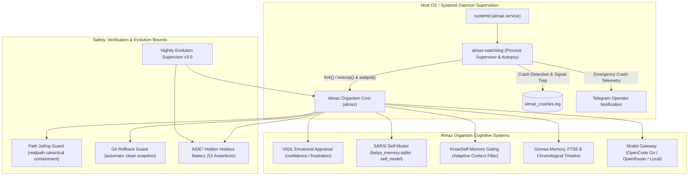

# Almaz — Sovereign Self-Evolving, Self-Healing Autonomous AI Organism (Pure C99)

[](https://github.com/M4F-S/Almaz/releases/tag/v0.1.0-organism)
[](LICENSE)
[]()
[-brightgreen.svg)]()
[-brightgreen.svg)]()
[]()
[]()
[]()
[]()

Almaz is a **sovereign self-evolving, self-healing autonomous AI organism** implemented in pure C99. Unlike conventional command-line agents that terminate or halt on errors, Almaz operates under an autopoietic biological computing model: an introspective reasoning core continuously guarded by a dedicated POSIX sibling watchdog (`almaz-watchdog`), a persistent self-model (SARSI), an emotional appraisal state machine (VIGIL protocol), situational memory gating (KnowSelf), a 52-assertion hidden holdout regression harness (AIDE² safety framework), and Darwinian AST self-evolution.

---

## Table of Contents
- [The Organism Paradigm: Almaz vs Traditional Agents](#the-organism-paradigm-almaz-vs-traditional-agents)
- [Architectural Topology](#architectural-topology)
- [Core Sovereign Organism Subsystems](#core-sovereign-organism-subsystems)
  - [1. Sibling Watchdog Supervisor (`almaz-watchdog`) & Crash Autopsy](#1-sibling-watchdog-supervisor-almaz-watchdog--crash-autopsy)
  - [2. SARSI Persistent Self-Model & Introspective Calibration](#2-sarsi-persistent-self-model--introspective-calibration)
  - [3. VIGIL Emotional Appraisal System (Confidence & Frustration Dynamics)](#3-vigil-emotional-appraisal-system-confidence--frustration-dynamics)
  - [4. KnowSelf Situational Memory Gating](#4-knowself-situational-memory-gating)
  - [5. AIDE² Hidden Holdout Safety Suite (52/52 Assertions)](#5-aide²-hidden-holdout-safety-suite-5252-assertions)
  - [6. Nightly Evolution Supervisor v3.0 (Timeline Self-Healing)](#6-nightly-evolution-supervisor-v30-timeline-self-healing)
  - [7. Belya Agency: Multi-Agent Orchestration Engine](#7-belya-agency-multi-agent-orchestration-engine)
  - [8. Model Gateways: OpenCode Go & OpenRouter](#8-model-gateways-opencode-go--openrouter)
  - [9. Jev TypeSafe AI Structured Coprocessor](#9-jev-typesafe-ai-structured-coprocessor)
  - [10. 3-Zone Prefix Caching & Persistent Sockets](#10-3-zone-prefix-caching--persistent-sockets)
  - [11. Workspace Path Jailing & Sandboxing](#11-workspace-path-jailing--sandboxing)
- [Native Tool Suite (18 Built-In Tools)](#native-tool-suite-18-built-in-tools)
- [Command & Slash Controls Reference](#command--slash-controls-reference)
- [Operating Modes](#operating-modes)
  - [Mode 1: 24/7 Supervised VPS Daemon (Watchdog + Telegram)](#mode-1-247-supervised-vps-daemon-watchdog--telegram)
  - [Mode 2: Terminal Interactive CLI](#mode-2-terminal-interactive-cli)
  - [Mode 3: Headless Batch / CI/CD Mission](#mode-3-headless-batch--cicd-mission)
  - [Mode 4: Multi-Agent Orchestration Mode](#mode-4-multi-agent-orchestration-mode)
- [Automated Verification & Test Suites](#automated-verification--test-suites)
  - [1. Unit Test Suite (37/37 Passed - 100%)](#1-unit-test-suite-3737-passed---100)
  - [2. Hidden Holdout Regression Suite (52/52 Assertions - 100%)](#2-hidden-holdout-regression-suite-5252-assertions---100)
  - [3. Zero-Tolerance Memory Safety (ASan/UBSan)](#3-zero-tolerance-memory-safety-asanubsan)
- [Configuration & Deployment (`.env`, `almaz.service`)](#configuration--deployment-env-almazservice)
- [Ecosystem Relationship: Almaz & Belya](#ecosystem-relationship-almaz--belya)
- [License](#license)

---

## The Organism Paradigm: Almaz vs Traditional Agents

Traditional AI agents (like Claude Code, Aider, or Hermes) are **stateless execution loops**: if an unhandled signal strikes, memory overflows, or a tool loop enters a deadlock, the process crashes, losing state and demanding human operator triage.

Almaz rejects this fragility. Built on the principles of **autopoiesis** (self-creation and self-maintenance), Almaz couples its reasoning faculties to continuous biological-style autonomic nervous systems:

| Architectural Dimension | Traditional AI Agents | Almaz Autonomous Organism |
|:---|:---|:---|
| **Process Model** | Single fragile process | Two-process biological symbiosis (`almaz-watchdog` + `almaz`) |
| **Crash Recovery** | Process exits; terminal dies | Signal interception, core autopsy log, Telegram alert, exponential auto-restart |
| **Self-Awareness** | Zero internal state awareness | **SARSI**: Persistent calibration of capability, tool success rates, turn counts, and RSS |
| **Affective Modulation** | Pure token probability | **VIGIL**: Real-time `confidence` & `frustration` tracking triggering proactive strategic pivots |
| **Memory Access** | Blind brute-force vector retrieval | **KnowSelf**: Situational gating skipping redundant queries when context is sufficient |
| **Code Evolution** | Static binary compiled once | **Darwinian AST Mutation**: Nightly self-optimization gated by a 52-assertion holdout harness |
| **Resource Envelope** | 250 MB – 1.2 GB (Python/Node) | **< 3.5 MB Idle RSS / < 18 MB Peak** (Pure C99) |

---

## Architectural Topology



---

## Core Sovereign Organism Subsystems

### 1. Sibling Watchdog Supervisor (`almaz-watchdog`) & Crash Autopsy
Almaz does not run unmonitored. On production servers, `almaz.service` boots `almaz-watchdog`, a specialized C supervisor that:
- Spawns and supervises `./almaz --telegram` via POSIX `fork()`, `execvp()`, and `waitpid()`.
- Captures POSIX abnormal termination signals: `SIGSEGV` (segmentation violation), `SIGBUS` (bus error), `SIGABRT` (assertion failure), `SIGFPE` (floating point arithmetic exception), and `SIGILL` (illegal instruction).
- Performs instant post-mortem analysis: records timestamp, signal number, process uptime, and recent system telemetry to `almaz_crashes.log`.
- Dispatches an emergency autopsy notification directly to the human operator's Telegram channel with root-cause signal diagnosis.
- Implements exponential backoff auto-recovery with a rapid-crash circuit breaker (prevents infinite reboot loops if catastrophic config defects exist).

### 2. SARSI Persistent Self-Model & Introspective Calibration
Almaz maintains a dedicated, persistent mathematical self-model in SQLite (`self_model` table):
- **Proprioceptive Telemetry**: Tracks cumulative lifetime turns, successful turns, tool invocation counts, failure rates, total tokens ingested/emitted, and Resident Set Size (RSS memory).
- **Capability Calibration**: Dynamically updates success ratios per tool type, adjusting agent routing weights based on verified empirical outcomes rather than theoretical prompt claims.
- **Introspective API**: `almaz_agent_get_self_model()` and `almaz_agent_update_self_model()` expose live self-knowledge directly into Ephemeral Context (Zone 3), allowing the agent to reason about its own resource boundaries and reliability.

### 3. VIGIL Emotional Appraisal System (Confidence & Frustration Dynamics)
Almaz implements an affective state machine tracking two core emotional axes:
- `confidence` ($[0.0, 1.0]$, initialized at $0.80$): Boosted by successful tool executions, syntax verification passes, and test completions. Decays upon failures and timeouts.
- `frustration` ($[0.0, 1.0]$, initialized at $0.00$): Incremented when tool calls fail, compile checks reject edits, or circuit breakers trip.
- **Proactive Strategic Pivoting**: When frustration crosses $0.60$ or confidence drops below $0.40$, Almaz intercepts the execution cycle, suppresses repetitive retries, and forces a cognitive pivot directive:
  > *"Operational frustration elevated (0.75). Current strategy failing. Abandon current tool trajectory, inspect root cause with read_file, and execute alternative solution."*

### 4. KnowSelf Situational Memory Gating
Unchecked RAG (Retrieval-Augmented Generation) inflates context windows with irrelevant memories, degrading reasoning speed and increasing inference costs. Almaz features **KnowSelf Situational Memory Gating** (`almaz_should_retrieve_memory()`):
- Evaluates prompt length, conversational depth, and query semantics.
- For simple greetings, short instructions, or self-contained tasks, memory retrieval is gated OFF, saving ~800–1,500 tokens of noise per turn.
- Automatically gates retrieval ON for research tasks, cross-session recalls, architecture audits, or explicit historical queries.

### 5. AIDE² Hidden Holdout Safety Suite (52/52 Assertions)
To allow Darwinian self-evolution without risking catastrophic degradation or code rot, Almaz enforces the **AIDE² Hidden Holdout Protocol** (`make holdout`):
- **52 Strict Invariable Assertions** testing 9 core sub-architectures:
  1. `DynString` capacity bounds, reallocation, and formatting safety.
  2. `MiniJSON` deep nesting, Unicode escaping, and tokenization.
  3. `YAML Frontmatter` CRLF/LF delimiter and boundary resilience.
  4. `Workspace Path Jailing` traversal containment across all file tools.
  5. `SARSI Self-Model` persistence, update math, and schema lifecycle.
  6. `Emotional Appraisal` dynamic clamping, decay, and threshold triggers.
  7. `KnowSelf Memory Gating` precision under diverse turn conditions.
  8. `BPE Token Estimator` boundary conditions and edge cases.
  9. `Metacognitive Circuit Breaker` doom-loop trip and recovery behavior.
- Any autonomous mutation that fails even a single assertion is discarded immediately.

### 6. Nightly Evolution Supervisor v3.0 (Timeline Self-Healing)
Every night at 03:00 UTC, the `almaz-daily.timer` invokes `evolution_supervisor.py`:
- Scans `belya_memory.sqlite` event timeline for tool errors, compilation failures, and frustration spikes encountered during production operations.
- Synthesizes targeted hot-path optimizations (e.g. string routines, JSON parser throughput).
- Runs candidate mutations in isolated sandbox jails under AddressSanitizer and validates both the 37-unit-test suite and the 52-assertion holdout suite.
- Candidate mutations with zero leaks, 100% test pass, and provable latency reductions are merged and tagged autonomously.

### 7. Belya Agency: Multi-Agent Orchestration Engine
Almaz embeds the sovereign multi-agent agency engine (`--agency` / `/agency`):
- **Declarative Agent Manifest Protocol (`agents/*.md`)**: Specializes agents by role (`triage`, `architect`, `builder`, `reviewer`, `tester`).
- **Least-Privilege Tool Bounding**:
  - `Architect`: Pure read-only reconnaissance (`read_file`, `search_files`, `list_dir`, `git_status`, `git_diff`).
  - `Builder`: Surgical code mutator (`read_file`, `write_file`, `edit_file`, `apply_patch`).
  - `Reviewer`: Code auditor and diff inspector.
  - `Tester`: Restricted test runner (`make`, `test`, `echo`).
- **Git Rollback Guard**: Snapshots `HEAD` SHA before mutative execution; automatically executes `git reset --hard` and `git clean -fd` if subagents fail or loop.

### 8. Model Gateways: OpenCode Go & OpenRouter
Almaz natively supports high-throughput model gateways with persistent TLS keep-alive:
- **OpenCode Go Backend**: Flat-rate subscription inference via `https://opencode.ai/zen/go/v1` with automatic `x-opencode-session` injection.
- **OpenRouter Multi-Model Gateway**: Sub-200ms routing to frontier models (`deepseek/deepseek-v4.1-flash`, `qwen/qwen-2.5-coder-32b`, `anthropic/claude-3.7-sonnet`).
- **Local Fallback**: Full compatibility with local inference engines (Ollama, vLLM, llama.cpp).

### 9. Jev TypeSafe AI Structured Coprocessor
Native integration with Jev TypeSafe AI (`https://jevtypesafeai.com`):
- Sub-200ms request triage (`/decide`) routing prompts to specialized roles.
- Real-time tool risk scoring (`/agent/risk`), blocking commands with risk $>0.85$.
- Context distillation (`/context/filter`) pruning noise during session compaction.

### 10. 3-Zone Prefix Caching & Persistent Sockets
- **Zone 1 (Byte-Locked Prefix)**: System prompt and static capabilities manifest locked for 95%+ prompt cache read hits.
- **Zone 2 (Append-Only Trajectory)**: Conversation and tool observations appended sequentially.
- **Zone 3 (Ephemeral Context)**: Proprioceptive self-telemetry, SARSI calibration, and VIGIL affective state injected without invalidating Zone 1/2 caches.
- **Persistent HTTP Sockets**: Handles in `ModelGateway` maintain active TLS 1.3 keep-alive sockets, eliminating 150–250ms of handshake latency per turn.

### 11. Workspace Path Jailing & Sandboxing
All file access tools (`read_file`, `write_file`, `edit_file`, `apply_patch`, `list_dir`) enforce strict canonical boundary containment via `realpath(3)`, preventing path traversal attacks (`../../etc/passwd`).

---

## Native Tool Suite (18 Built-In Tools)

| Tool Name | Parameters | Description |
|:---|:---|:---|
| **`bash`** | `command` (str) | Executes shell commands with persistent CWD tracking & timeout protection |
| **`read_file`** | `path` (str), `offset` (num), `limit` (num) | Reads file contents with line-number slicing |
| **`write_file`** | `path` (str), `content` (str) | Writes text directly to disk with pre-flight compiler syntax check |
| **`edit_file`** | `path`, `old_text`, `new_text`, `verify_compile` (bool) | Exact search-and-replace edit with compiler verification guard and auto-revert |
| **`apply_patch`** | `path` (str), `patch` (str) | Multi-hunk structured replacement patch engine (`<<<<<<< SEARCH ... ======= ... >>>>>>> REPLACE`) |
| **`list_dir`** | `path` (str) | Inspects directory contents |
| **`search_files`** | `pattern` (str), `path` (str), `file_glob` (str) | Recursively searches text patterns across codebase files (grep-like) |
| **`git_status`** | *(none)* | Inspects Git working copy status |
| **`git_diff`** | `staged` (bool), `path` (str) | Inspects staged or unstaged Git diffs |
| **`save_memory`** | `topic` (str), `content` (str) | Stores verified knowledge into SQLite persistent memory with wing/room scoping |
| **`recall_memory`** | `query` (str) | Searches SQLite memory using sanitized FTS5 queries and BM25 ranking |
| **`save_skill`** | `name` (str), `trigger` (str), `description` (str), `instructions` (str) | Distills and indexes reusable procedural skills with automatic deduplication |
| **`recall_skill`** | `query` (str) | Retrieves curated procedural skills with progressive disclosure |
| **`recall_conversation`** | `query` (str) | Searches historical conversation sessions and timestamps in SQLite |
| **`fetch_url`** | `url` (str), `method` (str), `headers` (obj), `body` (str) | Native HTTP/REST client supporting GET, POST, PUT, DELETE, and payloads |
| **`spawn_subagent`**| `task` (str), `instructions` (str), `max_turns` (num) | Spawns isolated worker subagent and returns structured execution envelope |
| **`define_tool`** | `name`, `description`, `parameters`, `script_body` | Dynamically creates, scripts, persists, and registers new executable tools with full parameter contracts |
| **`dispatch_agent`**| `role` (str), `task` (str), `context` (str) | Dispatches specialized subagent bounded by declarative manifest with automatic Git Rollback Guard |

---

## Command & Slash Controls Reference

| Command | Interface | Description |
|:---|:---|:---|
| `/help` | CLI & Telegram | Show command reference |
| `/status` | CLI & Telegram | View active model, endpoint, token usage, CWD, and session count |
| `/tools` | CLI & Telegram | Show all registered tools (including dynamic MCP & custom tools) |
| `/reset` *(or `/clear`, `/new`)* | CLI & Telegram | **Reset session history** (preserves system directives and persistent SQLite memory) |
| `/compact [N]` | CLI & Telegram | Prune older messages, keeping `N` recent turns |
| `/skills` | CLI & Telegram | View all curated procedural skills in the persistent registry |
| `/cache` | CLI & Telegram | Inspect 3-zone prompt cache hit rates and token savings |
| `/timeline [N]` | CLI & Telegram | View recent Gomaa chronological timeline event log |
| `/rules` | CLI & Telegram | View active repository guidelines (`.agentrules` / `AGENTS.md`) |
| `/sessions` | CLI & Telegram | List all saved conversation sessions in SQLite |
| `/save [id]` | CLI & Telegram | Checkpoint current conversation tree to database |
| `/resume <id>` | CLI & Telegram | Restore past conversation session by ID |
| `/reflect` | CLI & Telegram | Distill recent trajectory into reusable SQLite skill |
| `/export <session_id> <file>` | CLI & Telegram | Export session trajectory to OpenAI fine-tune JSONL format |
| `/checkpoint [id]` | CLI & Telegram | Create instant Git & SQLite state checkpoint |
| `/rollback <id>` | CLI & Telegram | Rollback workspace files and context to a past checkpoint |
| `/model <name>` | CLI & Telegram | Switch active AI model dynamically |
| `/cwd [path]` | CLI & Telegram | View or change current working directory |
| `/mcp <cmd>` | CLI & Telegram | Connect to an external stdio MCP server |
| `/agency <prompt>` | CLI & Telegram | Execute task using Belya Agency multi-agent pipeline (Triage → Architect → Builder → Tester) |

---

## Operating Modes

### Mode 1: 24/7 Supervised VPS Daemon (Watchdog + Telegram)

Almaz runs on production Linux servers as a supervised background daemon connected to `@AlmaztheBot`:
```bash
# Build the organism and watchdog binaries:
make

# Run directly via watchdog supervisor:
./almaz-watchdog --telegram
```

Under systemd, `almaz.service` runs `almaz-watchdog --telegram`:
```bash
sudo systemctl status almaz.service
sudo journalctl -u almaz -f
```

### Mode 2: Terminal Interactive CLI

Launch the interactive REPL for local development, pairing, or diagnostics:
```bash
./almaz
```

### Mode 3: Headless Batch / CI/CD Mission

Execute automated single-turn missions or scripts:
```bash
./almaz --prompt "Audit src/ for memory leaks and run holdout suite"
```

### Mode 4: Multi-Agent Orchestration Mode

Execute compound engineering missions via the Chief-of-Staff multi-agent pipeline:
```bash
./almaz --agency "Implement lock-free ring buffer and verify with tests"
```

---

## Automated Verification & Test Suites

### 1. Unit Test Suite (37/37 Passed - 100%)
```bash
make test
```
```text
================ Running Almaz Super Strict Test Suite ================
[Test] DynString Operations...                                      PASSED
[Test] MiniJSON Parser & Serializer...                              PASSED
[Test] BPE-calibrated Token Estimator...                            PASSED
[Test] Agent Memory (FTS5) & Rules Auto-Discovery...               PASSED
[Test] Session Checkpointing & Resumption...                        PASSED
[Test] Dynamic Self-Tooling (define_tool & Custom Script)...        PASSED
[Test] Harness Tool Suite (13 Tools) & Patch Engine...              PASSED
[Test] Telegram Bot Adapter Security & Ephemeral Lifecycle...       PASSED
[Test] Pre-Flight Compiler Watchdog (Auto-Healing Loop)...          PASSED
[Test] Native Web Content Retrieval (fetch_url)...                  PASSED
[Test] Gomaa Memory Paradigm (Scoping, Salience & Timeline)...      PASSED
[Test] Tool-Call Scavenger Engine (DeepSeek/Reasoning)...           PASSED
[Test] Skills Curation & Progressive Disclosure Loop...             PASSED
[Test] Git & State Checkpoint and Instant Rollback...               PASSED
[Test] Trajectory Exporter (OpenAI Fine-Tune JSONL)...              PASSED
[Test] Historical Conversation Search & REST Retrieval...           PASSED
[Test] Advanced REST Client (Multi-Method, Headers, JSON)...        PASSED
[Test] Tool-Call Scavenger Deep Stress & Edge-Case Parser...        PASSED
[Test] Multi-Turn Checkpointing & Rollback State Machine...         PASSED
[Test] Progressive Disclosure Manifest & Salience Priority...       PASSED
[Test] Forced Synthesis on Step Exhaustion & Keep-Alive...          PASSED
[Test] v6.0 Resilient Edit Fallback, Regex Search & Diag...         PASSED
[Test] Exhaustive Verification of All 17 Tools & Edge Cases...     PASSED
[Test] Skills Lifecycle: Trigger Matching & Salience Boost...       PASSED
[Test] Subagent Recursion Guard & Sandbox Tool Isolation...        PASSED
[Test] Self-Telemetry, RSS Calculation & Proprioception...          PASSED
[Test] Metacognitive Circuit Breaker & Verification Guard...        PASSED
[Test] Track A.1: Workspace Path Jailing (is_path_jailed)...        PASSED
[Test] Track A.2: C99 Markdown Frontmatter Parser...                PASSED
[Test] Track A.3: File-First Skills System (skills/*/SKILL.md)...   PASSED
[Test] Track A.4: Composable Rule Packs (rules/*/*.md)...           PASSED
[Test] Track A.5: Systematic TROUBLESHOOTING.md Resolver...         PASSED
[Test] Track B: Belya Agency Multi-Agent & Rollback Guard...        PASSED
[Test] Jev TypeSafe AI Integration & Coprocessor Parser...          PASSED
[Test] SARSI Persistent Self-Model (Organism Introspection)...      PASSED
[Test] VIGIL Emotional Appraisal State Machine...                   PASSED
[Test] KnowSelf Situational Memory Gating...                        PASSED
================ All Tests Passed Successfully (37/37 - 100%) ================
```

### 2. Hidden Holdout Regression Suite (52/52 Assertions - 100%)
```bash
make holdout
```
```text
================ Running Almaz Hidden Holdout Benchmark Suite ================
  [Holdout 1/9] DynString Boundaries: PASSED
  [Holdout 2/9] MiniJSON Depth & Escaping: PASSED
  [Holdout 3/9] YAML Frontmatter CRLF Delimiters: PASSED
  [Holdout 4/9] Workspace Path Jailing: PASSED
  [Holdout 5/9] SARSI Self-Model Lifecycle: PASSED
  [Holdout 6/9] Emotional Appraisal Dynamic Clamping: PASSED
  [Holdout 7/9] KnowSelf Memory Gating Precision: PASSED
  [Holdout 8/9] Token Estimator Limits: PASSED
  [Holdout 9/9] Metacognitive Circuit Breaker Resilience: PASSED
================ Holdout Benchmark Passed: 52/52 (100%) ================
```

### 3. Zero-Tolerance Memory Safety (ASan/UBSan)
Compiled and tested under AddressSanitizer and UndefinedBehaviorSanitizer:
```bash
make clean && make test CFLAGS="-Wall -Wextra -O2 -std=c99 -fsanitize=address,undefined -g -D_POSIX_C_SOURCE=200809L"
```
**Result: 0 memory leaks, 0 heap buffer overflows, 0 undefined behavior.**

---

## Configuration & Deployment (`.env`, `almaz.service`)

Create `.env` in the working directory:
```env
# OpenCode Go Flat Subscription Backend (Recommended)
MODEL_ENDPOINT=https://opencode.ai/zen/go/v1
MODEL_NAME=deepseek-v4.1-flash
MODEL_API_KEY=oc_sk_your-opencode-key

# OpenRouter Alternative Backend
# MODEL_ENDPOINT=https://openrouter.ai/api/v1/chat/completions
# MODEL_NAME=deepseek/deepseek-v4.1-flash
# MODEL_API_KEY=sk-or-v1-your-key

# Telegram Bot Credentials
TELEGRAM_BOT_TOKEN=123456789:ABCDefGhIJKlmNoPQRsTUVwxyZ
TELEGRAM_CHAT_ID=7934918808

# Jev TypeSafe AI Decision Coprocessor (Optional)
JEV_API_KEY=jev_sk_your-key
```

### Systemd Service Configuration (`/etc/systemd/system/almaz.service`)
```ini
[Unit]
Description=Almaz Sovereign Self-Evolving AI Organism & Telegram Daemon (Pure C99)
After=network.target

[Service]
Type=simple
User=root
WorkingDirectory=/opt/almaz
ExecStart=/opt/almaz/almaz-watchdog --telegram
Restart=always
RestartSec=5
StandardOutput=journal
StandardError=journal
LimitNOFILE=65535

[Install]
WantedBy=multi-user.target
```

---

## Ecosystem Relationship: Almaz & Belya

Almaz and Belya operate as complementary evolutionary tracks:

```
┌────────────────────────────────────────────────────────────────────────┐
│                        AI Engineering Ecosystem                        │
└───────────────────┬────────────────────────────────┬───────────────────┘
                    │                                │
                    ▼                                ▼
       ┌──────────────────────────┐     ┌──────────────────────────┐
       │   GitHub: M4F-S/Belya    │     │   GitHub: M4F-S/Almaz    │
       │     (Production Core)    │     │  (Autonomous Organism)   │
       │       Tag: v7.0.0        │     │    Tag: v0.1.0-organism  │
       │     Path: /opt/belya     │     │     Path: /opt/almaz     │
       │    Service: belya.service│     │    Service: almaz.service│
       └────────────┬─────────────┘     └────────────┬─────────────┘
                    │                                │
                    ▼                                ▼
        [Deterministic Software ]        [Autonomous Self-Evolving]
        [Engineering Workhorse  ]        [Self-Healing Organism   ]
        [34 Tests / ASan Clean  ]        [37 Tests + 52 Holdouts  ]
        [Production Deployments ]        [Watchdog + SARSI + VIGIL]
```

- **Belya (`M4F-S/Belya`)**: The rock-solid, deterministic C99 software engineering workhorse. Focused on production predictability, deterministic code generation, and direct competition with Claude Code and Hermes.
- **Almaz (`M4F-S/Almaz`)**: The sovereign, self-evolving, self-healing organism exploring autopoietic computing, biological supervisory loops, affective appraisal, and Darwinian code mutation.

---

## License

Licensed under the Apache License, Version 2.0 (the "License"); you may not use this file except in compliance with the License. You may obtain a copy of the License at:

[http://www.apache.org/licenses/LICENSE-2.0](http://www.apache.org/licenses/LICENSE-2.0)

Unless required by applicable law or agreed to in writing, software distributed under the License is distributed on an "AS IS" BASIS, WITHOUT WARRANTIES OR CONDITIONS OF ANY KIND, either express or implied. See the License for the specific language governing permissions and limitations under the License.
